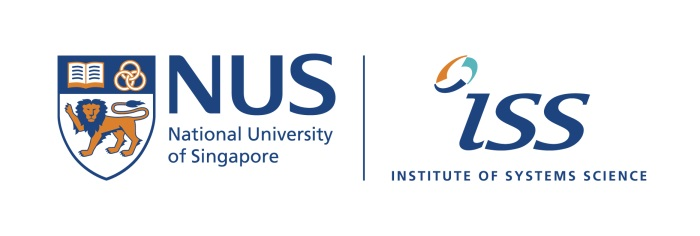

## Computational Intelligence 2 Workshops & References

.1. Optional workshop:

https://pythonhosted.org/scikit-fuzzy/

https://pythonhosted.org/scikit-fuzzy/auto_examples/plot_tipping_problem.html

.2. Explore and run past algorithmic trading system (ATS) CA project:

https://github.com/IRS-PM/Workshop-Project-Submission-Template-Trading

.3. More past ATSCA projects:

https://github.com/telescopeuser/fcpo_malaysia_trading

https://github.com/Institute-of-Systems-Science/SignalProcessing

Regarding past ATS CA projects trading profits (solution performance):

From your CA deliverables, especially in reports "Future Work section (or Defending Our Very Poor Profit Results)" I could see your frustration when facing negative returns, but I saw more of your genuine hard working effort to try to earn money, which is the purpose of CA work/system modelling. All your relevant efforts will be reflected in higher marks, well done!

Although your "smart selective high return" was show to impress, a scrutiny of your methods would suggest a more reasonable negative returns around single to double digit percentage loss (Don't worry, since all systems did badly if not worse =). Many systems used similar references and approaches, which made your results comparable, furthermore, mutually validating/benchmarking each other's numbers (made my life easier too), proving this FCPO is a difficult to earn money case.

---

**Co-Lecturer: [GU Zhan (Sam)](https://www.iss.nus.edu.sg/about-us/staff/detail/201/GU%20Zhan "GU Zhan (Sam)")**

**zhan.gu@nus.edu.sg**

Institute of Systems Science

National University of Singapore

